# OSDN NNsi : NNsiの使用方法説明

**本ページは、[OSDN の NNsi プロジェクト NNsiの使用方法説明](http://osdn.net/projects/nnsi/nnsi-ref.html) の復元です。**

-----

<!DOCTYPE HTML PUBLIC "-//IBM//DTD HPB HTML//EN">

<HTML>
<HEAD>
<META name="GENERATOR" content="IBM HomePage Builder V3.0.7  for Windows">
<META name="Content-Language" content="ja">
<META http-equiv="Content-Type" content="text/html; charset=EUC-JP">
<TITLE>NNsi - The &quot;2ch&quot; viewer for PalmOS</TITLE>
</HEAD>

<BODY bgcolor="#efefef">

<H1>NNsiの使用方法説明</H1>

<H2>もくじ</H2>
<UL>
  <LI><A href="#Notice">はじめに</A>
  <LI><A href="#Usage">NNsiの使い方</A>
  <LI><A href="#Installation">NNsiのインストールと起動</A>
  <LI><A href="#Preparation">使用前の準備(ネットワークの接続設定)</A>
  <LI><A href="#FirstTime">初回起動時の作業</A>
  <UL>
    <LI><A href="#GetBBS">BBS一覧の取得</A>
    <LI><A href="#SelectBBS">使用するBBSの選択</A>
  </UL>
  <LI><A href="#Setting">NNsi設定</A>
  <UL>
    <LI><A href="#NNsiSet1">NNsi設定</A>
    <LI><A href="#NNsiSet2">NNsi設定-2</A>
    <LI><A href="#NNsiSet3">NNsi設定-3</A>
    <LI><A href="#NNsiSet4">NNsi設定-4</A>
  </UL>
  <LI><A href="nnsi-key.htm">NNsiのキー操作</A>
  <LI><A href="nnsi-shots.html">NNsiのスクリーンショット</A>
</UL>

<H2><A name="Notice">はじめに</A></H2>

NNsiは、Palmデバイス上で動作する、２ちゃんねるビューアです。PalmというPDAデバイスで動作する関係上、他の２ちゃんねるブラウザにはない特徴(利点および欠点)を持っています。そのコンセプトを交え、NNsiの持つ機能を説明してみたいと思います。もしよろしければ、ご一読ください。

<H2><A name="Usage">NNsiの使い方</A></H2>

NNsiの使い方は、大きく分けて次の３つがあります。ユーザの環境に合わせて使用方法を選択してください。

<DL>
  <DT><B>[Palmデバイス単体での使用]</B>
  <DD>通常の２ちゃんねるブラウザと同様、NNsi単体でネットワークからログ取得、参照、書きこみを行う方法です。Palmデバイスに通信機器（赤外線付き公衆電話でもＯＫです）が必要になります。 
 
  <DT><B>[他２ちゃんねるビューアのログを、<A href="http://isweb42.infoseek.co.jp/computer/gikosipo/">ギコのしっぽ</A>経由での使用]</B>
  <DD>「<A href="http://isweb42.infoseek.co.jp/computer/gikosipo/">ギコのしっぽ</A>」は、ギコナビ、かちゅーしゃ、ホットゾヌ、ABone、Jane2ch、えまのんの２ちゃんねるログをMeDoc形式もしくはNNsi形式に変換、Palmデバイスにインストールするツールです。(ギコのしっぽは、Windows上で稼動します。) 
このツールを使用して２ちゃんねるログをNNsi形式でPalmデバイスに送り込み、NNsiの「参照専用ログ」として参照する方法です。SDカードやメモリースティックなどの外部ストレージを持たず、かつPalmデバイス用の通信機器を持たない場合には、この方法で使用してください。 
 
  <DT><B>[SDやメモリースティックなど、VFS上にある他２ちゃんねるブラウザのログを使用]</B>
  <DD>SDやメモリースティックなどの外部ストレージがある場合、その外部ストレージにギコナビ、ホットゾヌ、ABone等のログを置き、そのログがある(ベース)ディレクトリをファイル(/Palm/Programs/2ch/logdir.txt)で指定して参照する、という方法です。この方法をうまく使うと、外部ストレージにWindows用の２ちゃんねるブラウザをインストールし、そのログをNNsiが覗き見することが可能です。（巡回およびログ取得、そして通常はWindowsで２ちゃんねるに参加し、出先でのログ確認にPalmデバイスを使う、ということを想定した使い方です。) 
 
</DL>
<H2><A name="Installation">NNsiのインストールと起動</A></H2>

通常のPalmアプリケーションと同じです。NNsi.prcをHotSync/BeamしてPalmデバイスに転送してください。すると、メニューにNNsiが現れます。(図１を参照してください。) 
このアイコンをタップすることで、NNsiが起動します。 

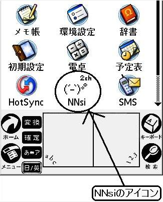 
&lt; 図１：NNsiのアイコン &gt;

<H2><A name="Preparation">使用前の準備 (ネットワークの接続設定）</A></H2>

NNsi単体で通信を行い、直接２ちゃんねるへ読み書きを行いたい場合には、ネットワークの設定が必要となります。しかし、NNsi単体では特殊な設定は必要となりませんので、ここでは詳しく書きません。申し訳ありませんが、どこかのサイトもしくはPalmの参考書等を参照し、<B><U>あらかじめ「環境設定」メニューでネットワークの設定を行ってください。</U></B>
(よろしくお願いします。)

<H2><A name="FirstTime">初回起動時の作業</A></H2>

NNsiをはじめて起動したとき、NNsiを使用するためにいくらかの作業が必要となります。それは、「板(BBS)一覧を取得すること」と「使用する板(BBS)を選択」することです。また、ログをメモリースティックやSDカードに記録する場合には、あわせて「NNsi設定」も適切に設定してやる必要があります。NNsi設定は別項でとりあげますので、ここでは、板の取得と選択について解説します。

さて、NNsiを一番最初に起動させると、ワーニングウィンドウが２つないし３つ表示されます。１つめは、「NNsi設定を初期化しました(図２)」、２つめは、VFSデバイス搭載機のみに表示される警告メッセージ(図３)、そして最後にＢＢＳ一覧がない(図４)、という警告メッセージです。 

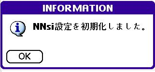 
&lt; 図２：NNsi設定を初期化 &gt; 
 
 
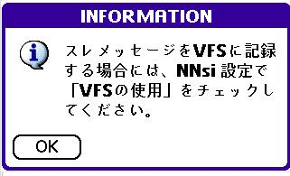 
&lt; 図３：警告メッセージ(ＶＦＳ使用可能Palm機のみ)&gt; 
 
 
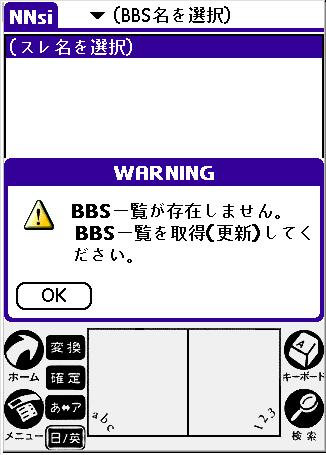 
&lt; 図４：BBS一覧がない &gt;

<H2><A name="GetBBS">BBS一覧の取得</A></H2>

NNsiを使用するために、BBS一覧の取得が必要です。 <B><U>（ネットワークに接続しない場合でも必ずＢＢＳ一覧の取得操作が必要になります。ご注意ください。）</U></B> 
BBS一覧の取得を行うためには、「メニュー」→「Manage」→「BBS一覧取得」という操作を行ってください。(図５)

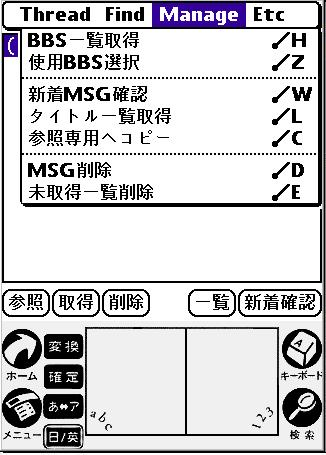 
&lt; 図５：BBS一覧の取得 &gt;

「BBS一覧取得」を指示すると、板名の一覧を取得先を確認するメッセージが表示されます（図６）。
<B>このまま通信を行い、板一覧を取得する場合には、&quot;OK&quot;を、ネットワークに接続しない場合には、&quot;Cancel&quot;を押してください。</B>OKを押した場合には、指定先から板一覧を取得し、Cancelを押した場合には、「使用するＢＢＳの選択」にすすみます。 

<H3>BBS一覧取得における注意事項</H3>

通常は、最初に指定したURLで板一覧の取得が可能なのですが、ある環境下では、板一覧の取得に失敗するとの報告を受けています。そういった場合には、NNsi設定の「BBS一覧取得先URLを旧URLに」にチェックを入れることで板一覧を取得することが可能とのことです。また、この旧URLでも取得に失敗する最悪の場合でも、NNsi設定-2の「BBS一覧取得先(URL)」に取得先URLを記載することで回避可能です。（詳しくはNNsi設定およびNNsi設定-2の説明をご参照ください。）

 

<H2><A name="SelectBBS">使用するBBSの選択</A></H2>

<B>NNsiは、あらかじめ使用する板を選択しておく必要があります。</B>これは、Palmデバイスの画面が160x160と小さいという事情があり、板の一覧表示を必要最小限に絞り、またなるべくすくないストロークで板の切り替えを可能にするための仕様です。 
<B>現状は、カテゴリの区別なくURLのアルファベット順に並んでいるため、使用する板を抜き出すのは結構大変かと思います。大変申し訳ありません。（そのうち改善したいと思います。）</B> 
ネットワークに接続しない人は、「参照専用ログ(GikoShippo)」にチェックがついていることを確認し、&quot;設定&quot;ボタンを押してください。（図６） 
それ以外は、使用するBBSにチェックを入れ、&quot;設定&quot;ボタンを押してください。

 

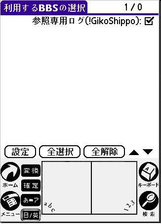 
&lt; 図６：使用するBBSの選択(ネットワーク接続しない場合) &gt; 
 
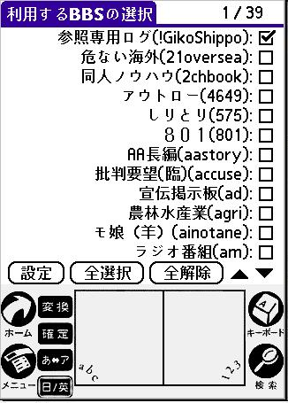 
&lt; 図７：使用するBBSの選択(ネットワークから取得した場合 &gt;

この操作で、NNsiを使用する準備が整いました。(図８) <B><U>ただし、ログをVFSデバイス(メモリースティック、SDカードなど)に記録する場合には、すぐにNNsiを使用するのではなく、NNsi設定で設定を済ませた後、NNsiを一度終了してから再度立ち上げてください。</U></B> 
 

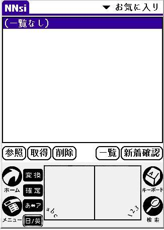 
&lt; 図８：NNsiの使用準備終了状態 &gt;

<STRONG><B>以上でNNsi使用の準備が完了です。(お疲れ様でした)</B></STRONG>

<H2><A name="Setting">NNsi設定について</A></H2>

NNsiは、機能を切りかえるパラメータスイッチを数多く持っています。それを「NNsi設定-x」画面で設定します。これらパラメータスイッチは、NNsiの前バージョンとの下位互換性を保つ、またNNsi利用者が考える使い方が複数ある、製作者のヤな予感（Experimentalな実装)などによって用意されています。 
 
NNsi設定は、本体内DBに記録されNNsi起動時に設定値を復元しますが、<B>現状、NNsiのバージョンアップ(もしくはリビジョンアップ)を行うと、NNsi設定はクリアされる仕様となっています。</B>これは、NNsi設定の項目に追加・整理した場合（動作がおかしくなることがないよう）安全のために初期化しているためです。将来的にはバージョンアップ・リビジョンアップを行っても前回の設定を引き継げるようにしたいと思います。 
 
NNsi設定系画面は、画面左下のＯＫボタン、もしくは右上の数字を押すことで設定内容が確定します。（Cancelボタンを押した場合には、設定を有効にせずスレ一覧画面に戻ります。） 
右上の数字を押すと、他のNNsi設定系画面を開くことができます。 

<H3><A name="NNsiSet1">NNsi設定</A></H3>

NNsi設定では、(なるべく)NNsi一覧画面およびNNsi全般に関わる設定を行います。

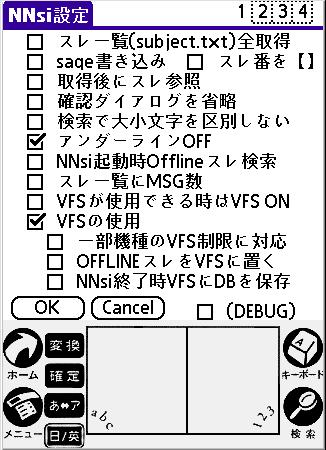 
&lt; 図９： NNsi設定 &gt;

<DL>
  <DT><B>スレ一覧(subject.txt)全取得</B>
  <DD>NNsiは、スレの一覧取得を実施した場合<U>通常は全てのスレ一覧を取得しません。</U>（ 
これは、全スレ一覧を取得するとPalmデバイスの通信速度(と処理時間)を考えた場合にかなり重荷になることが予測されたためです。） 
この項目にチェックを入れると、ほぼ全て(より正確には<A href="#WorkBufferSize">ワークバッファサイズ</A>分)のスレ一覧を取得、解釈し、表示します。
  <DT><B>sage書き込み</B>
  <DD>この項目にチェックを入れると、書きこみ画面を開いたとき、メール欄に
&quot;sage&quot; を自動的に記入します。 (この設定は、書きこみ画面にもあります。)
  <DT><B>スレ番を【】</B>
  <DD>この項目にチェックを入れると、参照画面を開いたとき、メッセージ番号を【】で囲みます。(通常は、[]でくくられています。)
  <DT><B>取得後にスレ参照</B>
  <DD>この項目にチェックを入れると、スレ一覧画面でスレを（ネットから）取得(新規取得/差分取得)したとき、<U>未読が存在した場合には</U>自動的にそのスレをOPENします。
  <DT><B>確認ダイアログを省略</B>
  <DD>この項目にチェックを入れると、NNsi全体で表示される確認メッセージには全てOKと答えたことにして次の処理に移ります。また、警告やエラー表示も(NNsiにとって非常に重要なもの以外は)表示しなくなります。
  <DT><B>検索で大小文字を区別しない</B>
  <DD>この項目にチェックを入れると、スレタイトル検索時、英語の大文字/小文字の区別をせずに検索を行います。（この設定は、検索文字列設定画面にもあります。）
  <DT><B>アンダーラインOFF</B>
  <DD>この項目にチェックを入れると、スレ参照画面のメッセージにアンダーラインを表示しません。ただし、ＣＬＩＥ用ハイレゾ表示ではこの設定如何に関わらずはアンダーラインは表示しません。（現在、NNsi設定を初期化すると、この項目には自動的にチェックが入ります。）
  <DT><B>NNsi起動時Offlineスレ検索</B>
  <DD>この項目にチェックを入れると、NNsiを起動したタイミングで『参照専用ログ』の一覧を検索します。
  <DT><B>スレ一覧にMSG数</B>
  <DD>この項目にチェックを入れると、スレ一覧画面で、スレタイトルの先頭それぞれにメッセージ数が表示されます。このメッセージ数ですが、取得前のスレはサーバ(2ch側)に記録されたメッセージ数を示し、取得後のスレはPalmデバイス内にあるメッセージ数を示します。ただし、<U>取得前→取得後の切り替わりタイミング（メッセージ取得直後）は、メッセージ数が表示されません。([???]と表示されます。)</U>
  <DT><B>VFSが使用できる時はVFS ON</B>
  <DD>この項目にチェックを入れると、NNsi起動時にVFS(SDやMMC、MSなどの外部メモリ)が使用できる場合には、VFS関連のNNsi設定（「VFSの使用」「一部機種のVFS制限に対応」「OFFLINEスレをVFSに置く」「NNsi終了時VFSにDBを保存）のチェックを全て入れます。通信時と参照ログ読みを排他的に利用する場合（VisorのSpringBoard、SDやMSで通信デバイスとフラッシュメモリの入れ替え、など）に、いちいちNNsi設定を変更せずNNsiを再起動するだけでこのあたりのスイッチが自動的に変更されることを考えています。
  <DT><B>VFSの使用</B>
  <DD>この項目にチェックを入れると、NNsiが取得したログをVFSに格納することができます。(ログの格納ディレクトリは
/Palm/Programs/NNsh です。) NNsiは、このディレクトリが存在することを前提に動作しますので、このチェックを入れて設定した後、NNsiを再起動してください。（このチェックは、VFSが使用可能となっているPalmデバイスのみ表示されます。）
  <DT><B>一部機種のVFS制限に対応</B>
  <DD>「一部機種」とは、具体的にはCLIE全機種(NXは未確認)になります。CLIEではMSへ書きこみをする場合に<A href="http://www.jp.sonypdadev.com/workshop/tips/index.html#99">制限事項</A>が存在するため、このチェックを入れると、その不具合を無理やり回避します。（逆にチェックを入れないと、ＭＳの内容を破壊するなど、予期せぬ挙動が起きるようです。。。）
  <DT><B>OFFLINEスレをVFSに置く</B>
  <DD>この項目にチェックを入れると、「参照専用ログ」をVFSに置くことができます。（ログディレクトリは、ファイル
/Palm/Programs/2ch/logdir.txt に指定されたディレクトリ以下になります。）
  <DT><B>NNsi終了時DBをVFSに保存</B>
  <DD>この項目にチェックを入れると、NNsiを終了するときに更新したPalm内部のDBをVFSにバックアップします。（バックアップするディレクトリは、/Palm/Programs/NNshです。） 
何らかの理由でPalmデバイスをハードリセットしなくてはならなくなった場合、バックアップしたDBファイルを復旧させることでNNsiを元通り使用することができるようになります。
  <DT><B>(DEBUG)</B>
  <DD>デバッグモードの指定です。この項目にチェックを入れると、デバッグ用にNNsiに埋め込んだメッセージがダイアログとして表示されます。<B>通常はこの項目にチェックを入れる必要はありません。</B>
</DL>

<H3><A name="NNsiSet2">NNsi設定-2</A></H3>

NNsi設定-2画面では、通信などの値設定が必要なものを主に設定します。

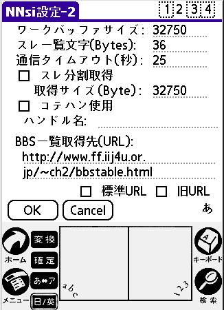 
&lt; 図10： NNsi設定-2 &gt;

<DL>
  <DT><B><A name="WorkBufferSize">ワークバッファサイズ</A></B>
  <DD>NNsi内部で使用するワークバッファの最大サイズを指定します(単位はバイト)。有効範囲は5120～61000で、初期値は32750です。（このワークサイズを基準にスレ一覧全取得が行われます。）
  <DT><B>スレ一覧文字(Bytes)</B>
  <DD>スレ一覧画面に表示する文字列の長さを規定します。有効範囲は、12～72で、初期値は36です。スレ一覧の文字列が全て表示されず途中で切れてしまう場合には、この値を拡大し、一覧表示できるサイズに調整してみてください。
  <DT><B>通信タイムアウト(秒)</B>
  <DD>サーバからの応答を待つ秒数です。初期値は25です。
  <DT><B>スレ分割取得</B>
  <DD>スレメッセージを取得するとき、全て一括で取得するのではなく指定されたバイト数までしか取得しないモードの設定です。（このモード設定は、スレ一覧画面のタイトル横のチェックボックスでも設定が可能です。） 
このスレ分割取得モードは、たとえば地下鉄乗車中NNsiを使用しているとき、駅停車中の時間で全てのスレデータをダウンロードしようとしても(スレサイズが大きく)タイムアウトになって取得できないようなスレを少しづつ取得する、というような使い方を想定しています。
  <DT><B>取得サイズ(Byte)</B>
  <DD>スレ分割取得で取得するメッセージの１回で取得するサイズを指定します。有効範囲は800～<A href="#WorkBufferSize">ワークバッファサイズ</A>で、初期値は32750です。
  <DT><B>コテハン使用</B>
  <DD>この項目にチェックを入れると、スレ書きこみ画面を開いたとき名前欄へ自動的に文字列を挿入します。（この設定は、スレ書きこみ画面でも可能です。）
  <DT><B>ハンドル名</B>
  <DD>コテハン使用にチェックが入っているときに名前欄に挿入する文字列を記述します。
80バイト(全角40文字)程度記入できます。
  <DT><B>BBS一覧取得先(URL) :</B>
  <DD>BBS一覧取得先のURLを記入します。通常は、後述の「標準URL」もしくは「旧URL」を表示しますが、ここに独自のURLを記入し、そこからBBS一覧を取得させることも可能です。
  <DT><B>標準URL</B>
  <DD>この項目にチェックを入れようとすると、2chの公式BBS一覧URLを「BBS一覧取得先(URL)」欄にコピーします。<U>（この項目には、チェックは入りません。）</U>
  <DT><B>旧URL</B>
  <DD>この項目にチェックを入れようとすると、2chの旧(公式)BBS一覧URLを「BBS一覧取得先(URL)」欄にコピーします。<U>（この項目には、チェックは入りません。）</U>
</DL>

<H3><A name="NNsiSet3">NNsi設定-3</A></H3>

NNsi設定-3は、NNsi設定、NNsi設定-2で入りきらなくなった(苦笑)設定項目を設定します。

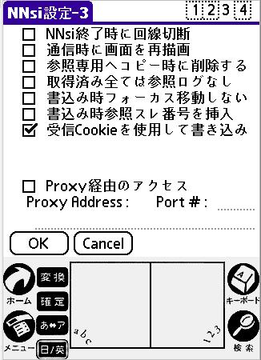 
&lt; 図11： NNsi設定-3 &gt;

<DL>
  <DT><B>NNsi終了時に回線切断</B>
  <DD>通常、NNsiを終了させただけでは、通信（回線）を終了させません。この項目にチェックを入れると、NNsiを終了させたタイミングで通信回線を切断します。
  <DT><B>「新着確認」終了時に回線切断</B>
  <DD>この項目にチェックを入れると、「新着確認」機能を実行した後で自動的に回線を切断します。
  <DT><B>通信時に画面を再描画</B>
  <DD>この項目にチェックを入れると、回線を接続後に一旦画面を消去し再描画します。<U>一部デバイスでは、回線を接続すると画面表示が乱れることがあります。そういったデバイスをお使いの場合には、この項目にチェックを入れてください。</U>
  <DT><B>参照専用へコピー時に削除する</B>
  <DD>この項目にチェックを入れると、スレを参照専用ログをコピーした後、連続してコピー元のスレを削除することができます。
  <DT><B>取得済み全ては参照ログなし</B>
  <DD>この項目にチェックを入れると、「取得済み全て」タブには「参照専用ログ」は表示されなくなります。
  <DT><B>書込み時フォーカス移動しない</B>
  <DD>この項目にチェックを入れると、スレ書きこみ画面で書込みメッセージフィールドへ自動的にカーソルを表示しないようになります。<U>CLIE
NXでATOKをご使用中の場合には、自動的にメッセージフィールドへカーソルを移動させるとかな漢字変換ができないという現象が発生しますので、この項目にチェックを入れてご使用ください。</U>
  <DT><B>書込み時参照スレ番号を挿入</B>
  <DD>この項目にチェックを入れると、スレ書きこみ画面の書きこみメッセージフィールドへ
&quot;&gt;&gt;???&quot; というレス参照番号を挿入します。
  <DT><B>受信Cookieを使用して書き込み</B>
  <DD>この項目にチェックを入れると、受信Cookieが必要な板に対して書きこみが可能になります。（NNsi設定初期化時には、このチェックは自動的に入ります。）
  <DT><B>Proxy経由でのアクセス</B>
  <DD>この項目にチェックを入れると、Proxyサーバ経由で2chの板へアクセスします。
  <DT><B>Proxy Address</B>
  <DD>この欄には、ProxyサーバのURLを記入してください。
  <DT><B>Port #</B>
  <DD>この欄には、ProxyサーバのProxy ポート番号を記入してください。
</DL>

<H3><A name="NNsiSet4">NNsi設定-4</A></H3>

NNsi設定-4では、主に各機種特有の機能について設定を行います。（一部の設定項目は、機能が有効になるデバイスでのみ表示されます。）

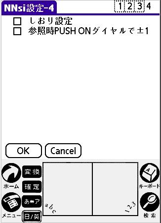 
&lt; 図12： NNsi設定-4 &gt;

<DL>
  <DT><B>しおり設定</B>
  <DD>旧NaNaShi互換の機能です。この項目にチェックを入れると、NNsi起動時に表示するメッセージ位置(どのスレの何番目のメッセージか）を決定することができます。しおり設定は、スレ参照画面の旗ボタン（「Ｍ」ボタン）で行います。しおり設定にチェックを入れ、<B><U>その設定が（スレを削除/移動させたりして)有効でない場合には、NNsi起動時には「からっぽ(タイトルが&quot;1:0&quot;と表示される)」のメッセージが表示されてしまいます。ご注意ください。</U></B>
  <DT><B>参照時PUSH ONダイヤルで±１</B>
  <DD>ジョグダイヤル押しまわしで、通常はメッセージを±１０移動させることができますが、このチェックを入れるとメッセージの移動が±１づつになります。
  <DT><B>WebBrowserで開くとき最新50</B>
  <DD>この項目にチェックを入れると、スレ一覧画面でWebBrowserを使ってスレを開くとき、最新50メッセージを開くようになります。
  <DT><B>参照画面でTiny Font使用</B>
  <DD><B>CLIE専用です。</B>この項目にチェックを入れると、スレ参照画面がハイレゾ表示モードに切り替わります。またこの機能は、スレ参照画面のメニュー「描画モード変更」によって切り替わります。
  <DT><B>ARMletを使用する</B>
  <DD><B>PalmOS5専用です。</B>この項目にチェックを入れると、一部関数にARMletを使用するようになります。（ただし、現状は劇的な高速化が行われる訳ではないため、『縁起モノ』程度と考えておいて間違いはありません...。）
</DL>

(Nov/30/2002)

</BODY>
</HTML>
